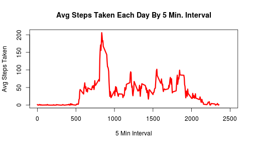
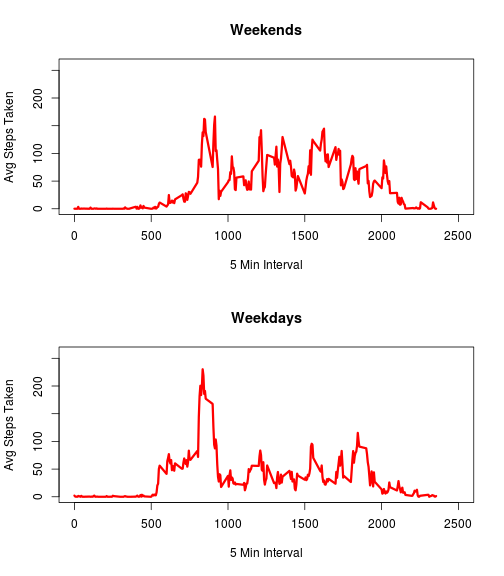

# Reproducible Research: Peer Assessment 1

Set options to make code visible

```r
opts_chunk$set(echo = TRUE, results = "asis")
```

## Loading and preprocessing the data

Assuming the local directory is "\RepData_PeerAssessment" and the data file "activity.csv" is found in the parent directory, I load the file.

```r
steps.df <- read.csv("../activity.csv")
```

Then I run some basic exploratory data analysis.

```r
str(steps.df)

nrow(steps.df)

head(steps.df, 20)

table (steps.df$date, useNA = "always")
```

The analysis shows total rows of 17,568 and existing NA values in the "steps"" variable. I may remove them later, for now no data transformation is needed.

## What is mean total number of steps taken per day?

First I calculate the total number of steps taken per day by using the split() and lapply() functions. I make sure to remove NA values during summarization.

```r
steps.list <- split(steps.df$steps
                    ,steps.df$date
)

steps.tot.list <- lapply(steps.list
                         ,sum
                         ,na.rm = TRUE
)

steps.tot.df <- data.frame(do.call(rbind
                                   ,steps.tot.list
)
)

colnames(steps.tot.df) <- ("tot.steps")
```

Now I show the results in a histogram.

```r
hist(steps.tot.df$tot.steps
     ,breaks = 30
     ,main = "Histogram of Total Number of Steps Taken Each Day"
     ,ylab = "Count of Days"
     ,xlab = "Number of Steps Taken"
)
```

 

Finally, I run the summary() function to show median and mean of total number of steps taken each day.

```r
summary (steps.tot.df)
```

   tot.steps    
 Min.   :    0  
 1st Qu.: 6778  
 Median :10395  
 Mean   : 9354  
 3rd Qu.:12811  
 Max.   :21194  

## What is the average daily activity pattern?

Here I use split() and lapply() functions to calculate the average number of steps
taken across all days by interval.  I make sure to remove NA values.

```r
steps2.list <- split(steps.df$steps
                     ,steps.df$interval
)

steps.mean.list <- lapply(steps2.list
                          ,mean
                          ,na.rm = TRUE
)

steps.mean.df <- data.frame(do.call(rbind
                                    ,steps.mean.list
)
)

colnames(steps.mean.df) <- ("avg.steps")
```

I can now create a time series plot of the 5 min. interval and the avg number
of steps taken across all days.


```r
plot (rownames(steps.mean.df)
      ,steps.mean.df$avg.steps
      ,type = "l"                                             
      ,col = "red"                                              
      ,lwd = 3                                                   
      ,xlab = "5 Min Interval"                                              
      ,ylab = "Avg Steps Taken"                                   
      ,main = "Avg Steps Taken Each Day By 5 Min. Interval"
      ,xlim = c(0,2500)
)
```

 

Further analysis shows the interval with max number of steps.


```r
index.1 <- which(steps.mean.df$avg.steps == max(steps.mean.df$avg.steps))

steps.mean.df$interval <- rownames(steps.mean.df)

steps.mean.df[index.1,]
```

Interval 835 with 206.1698 steps
has the maximum number of steps across all intervals.

## Imputing missing values

Let's find the total number of missing values in steps variable.

```r
mask <- is.na(steps.df$steps)

nrow(steps.df[mask,]) 
```
The total number of missing values is 2304

To replace missing values in a day for a particular interval, I will use the average number of steps across all days for that interval.

First I calculate the average number of steps across all days for each interval while removing NA values during the calculation.

```r
steps2.list <- split(steps.df$steps
                     ,steps.df$interval
)

steps.mean.list <- lapply(steps2.list
                          ,mean
                          ,na.rm = TRUE
)
```

Second, I create a copy of the original data frame. I call it steps.complete.df.

```r
steps.complete.df <- steps.df
```

Next I use the list of average values for each interval as a lookup to bring the average value.  The interval is the lookup key that matches the names in the list and the resulting vector is added as new column "avg.steps".  Lists work great as lookup tables! I use as.numeric() to get a vector in the result. Furthermore, because interval is integer in the steps.df data frame and character in the list, I convert values using as.character().

```r
steps.complete.df$avg.steps <- as.numeric(steps.mean.list[as.character(steps.df$interval)])
```

Using the new column, now I update the missing values in the first column.

```r
steps.complete.df[mask,1] <- steps.complete.df[mask,4]
```

To check results I compare rows in dates "2012-10-01", "2012-11-30" between the original and the data frame copy.

Original with missing values

```r
head(steps.df[steps.df$date == "2012-10-01" 
              & steps.df$interval > 200, 1]
     ,2
)
```

[1] NA NA

```r
head(steps.df[steps.df$date == "2012-11-30", 1]
     ,2
)
```

[1] NA NA


After update with no missing values

```r
head(steps.complete.df[steps.complete.df$date == "2012-10-01"
                       & steps.complete.df$interval > 200, 1]
     ,2
)
```

[1] 0.000 1.132

```r
head(steps.complete.df[steps.complete.df$date == "2012-11-30", 1]
     ,2
)
```

[1] 1.7170 0.3396

The total number of missing values in the data frame copy is 0


## Are there differences in activity patterns between weekdays and weekends?

First I convert variable "date" to Date datatype.  Then I use weekdays() function to create a weekend.flag which is added to the data frame as a factor.

```r
steps.complete.df$date <- as.Date(steps.complete.df$date)

steps.complete.df$weekend.flag <- ifelse(weekdays(steps.complete.df$date, TRUE) %in% c("Sat", "Sun"), "Yes", "No")

steps.complete.df$weekend.flag <- factor(steps.complete.df$weekend.flag
                                         ,levels = c("Yes", "No")
)
```

I do a quick check to make sure the weekend.flag works ok.  

Check "2012-11-29" which is Thu

```r
head(steps.complete.df[steps.complete.df$date == "2012-11-29", 5]
     ,2
)
```

[1] No No
Levels: Yes No

Check "2012-11-24" which is Sat

```r
head(steps.complete.df[steps.complete.df$date == "2012-11-24", 5]
     ,2
)
```

[1] Yes Yes
Levels: Yes No

To show difference in activity I create a panel plot containing a time series plot of the 5-minute interval (x-axis) and the average number of steps taken, averaged across all weekday days or weekend days (y-axis).

first I calculate average number of steps across all weekend days.

```r
steps.comp.wkend <- steps.complete.df[steps.complete.df$weekend.flag == "Yes", ]

steps.comp.wkend.ls <- split(steps.comp.wkend$steps
                             ,steps.comp.wkend$interval
)

steps.mean2.list <- lapply(steps.comp.wkend.ls
                           ,mean
)

steps.comp.wkend <- data.frame(do.call(rbind
                                       ,steps.mean2.list
)
)

colnames(steps.comp.wkend) <- ("avg.steps")
```

second I calculate average number of steps across all weekdays.

```r
steps.comp.wkday <- steps.complete.df[steps.complete.df$weekend.flag == "No", ]

steps.comp.wkday.ls <- split(steps.comp.wkday$steps
                             ,steps.comp.wkday$interval
)

steps.mean3.list <- lapply(steps.comp.wkday.ls
                           ,mean
)

steps.comp.wkday <- data.frame(do.call(rbind
                                       ,steps.mean3.list
)
)

colnames(steps.comp.wkday) <- ("avg.steps")
```

finally, I plot weekend vs. weekdays

```r
par(mfrow = c(2,1))

plot (rownames(steps.comp.wkend)
      ,steps.comp.wkend$avg.steps
      ,type = "l"                                             
      ,col = "red"                                              
      ,lwd = 3                                                   
      ,xlab = "5 Min Interval"                                              
      ,ylab = "Avg Steps Taken"                                   
      ,main = "Weekends"
      ,xlim = c(0, 2500)
      ,ylim = c(0, 260)
)

plot (rownames(steps.comp.wkday)
      ,steps.comp.wkday$avg.steps
      ,type = "l"                                             
      ,col = "red"                                              
      ,lwd = 3                                                   
      ,xlab = "5 Min Interval"                                              
      ,ylab = "Avg Steps Taken"                                   
      ,main = "Weekdays"
      ,xlim = c(0, 2500)
      ,ylim = c(0, 260)
)
```

 

